# 📖 Guía de Uso - Crypto-Wallet

> **Guía Completa para Usuarios**  
> Aprende a usar la billetera criptográfica fría paso a paso

---

## 📑 Tabla de Contenidos

1. [Instalación](#-instalación)
2. [Inicio Rápido](#-inicio-rápido)
3. [Uso Detallado](#-uso-detallado)
4. [Ejemplos Prácticos](#-ejemplos-prácticos)
5. [Solución de Problemas](#-solución-de-problemas)
6. [Preguntas Frecuentes](#-preguntas-frecuentes)

---

## 🚀 Instalación

### Requisitos Previos

- Python 3.7 o superior
- pip (gestor de paquetes de Python)

### Paso 1: Clonar el Repositorio

```bash
git clone [URL_DEL_REPOSITORIO]
cd "Proyecto Final"
```

### Paso 2: Instalar Dependencias

```bash
pip install cryptography customtkinter
py -m pip install customtkinter packaging
```

### Paso 3: Verificar Instalación

```bash
python app/main.py
```

Si la ventana gráfica se abre correctamente, ¡estás listo para comenzar! 🎉

---

## ⚡ Inicio Rápido

### Flujo Básico en 5 Pasos

```mermaid
graph LR
    A[1. Crear Billetera] --> B[2. Ver Dirección]
    B --> C[3. Crear Transacción]
    C --> D[4. Copiar a Inbox]
    D --> E[5. Verificar]
```



**Descripción Rápida:**

1. **Crear billetera nueva** con contraseña segura
2. **Ver tu dirección** pública para recibir fondos
3. **Firmar transacción** para enviar a otra dirección
4. **Copiar archivo** de outbox a inbox (simula red)
5. **Verificar transacción** recibida en inbox

---

## 📚 Uso Detallado

### 1️⃣ Crear una Nueva Billetera

#### Usando la Interfaz Gráfica (GUI)

1. Ejecuta la aplicación:
   ```bash
   python app/main.py
   ```

2. Haz clic en **"1. Crear nueva billetera (init)"**

3. Ingresa una **contraseña segura** cuando se te solicite
   
   > **¡NUNCA PIERDAS TU CONTRASEÑA!**  
   > No hay forma de recuperarla. Si la pierdes, perderás acceso a tus fondos.

4. Se creará el archivo `keystore.json` con tu billetera encriptada

#### Usando la Línea de Comandos (CLI)

```bash
cd app
python billetera.py
```

Selecciona opción **1** y sigue las instrucciones.

#### ¿Qué Sucede Internamente?

```python
# Se genera un par de llaves Ed25519
llave_privada = ed25519.Ed25519PrivateKey.generate()
llave_publica = llave_privada.public_key()

# Tu contraseña se convierte en una clave de encriptación
# usando Argon2id (resistente a ataques GPU)
kdf = Argon2id(salt=sal, iterations=2, memory_cost=64*1024)
clave_encriptacion = kdf.derive(contraseña)

# La llave privada se encripta con AES-256-GCM
aesgcm = AESGCM(clave_encriptacion)
llave_encriptada = aesgcm.encrypt(nonce, llave_privada, None)
```

#### Resultado Esperado

```
✅ Éxito. Billetera creada y guardada en 'keystore.json'
📍 Dirección: 0xcde2e3aed05e0e78cf8b22ce20afdcd412e64289
🔑 Llave Pública (Base64): Xy+bufSvVZutFTe1CdgxLi+kx3/U/cr1HHSVMh/qNKw=
⚠️ NO PIERDAS TU CONTRASEÑA O PERDERAS ACCESO A TUS FONDOS.
```

---

### 2️⃣ Ver Dirección y Llaves

#### Usando GUI

1. Haz clic en **"2. Ver mi dirección y llaves (load)"**
2. Ingresa tu contraseña
3. Se mostrará tu dirección pública

#### Usando CLI

```bash
cd app
python billetera.py
```

Selecciona opción **2**, ingresa tu contraseña.

#### ¿Para Qué Sirve Esto?

- **Dirección pública**: Compártela con otros para recibir transacciones
- **Llave pública**: Se usa para verificar tus firmas digitales
- **Llave privada**: NUNCA se muestra (permanece encriptada)

---

### 3️⃣ Crear y Firmar una Transacción

#### Usando GUI

1. Haz clic en **"3. Crear y firmar transacción (sign)"**

2. Ingresa tu **contraseña** para desbloquear la billetera

3. Completa los datos de la transacción:

   | Campo | Ejemplo | Descripción |
   |-------|---------|-------------|
   | **Dirección destino** | `0x1234abcd` | A quién envías |
   | **Cantidad** | `100` | Monto a transferir |
   | **Nonce** | `1` | Número de operación (incremental) |

4. La transacción firmada se guardará en `outbox/tx_0xcde2_1.json`

#### Usando CLI

```bash
cd app
python transaccion.py
```

Sigue las instrucciones en pantalla.

#### Anatomía de una Transacción

```json
{
  "tx": {
    "from": "0xcde2e3aed05e0e78cf8b22ce20afdcd412e64289",
    "to": "0x1234abcd",
    "value": "100",
    "nonce": 1,
    "gas_limit": 21000,
    "data_hex": "",
    "timestamp": "2025-12-03T20:30:00.000000+00:00"
  },
  "sig_scheme": "Ed25519",
  "signature_b64": "BV17QkV/Q4iBalYkkp2+hiwIyUGo...",
  "pubkey_b64": "Xy+bufSvVZutFTe1CdgxLi+kx3/U/cr1..."
}
```

#### Proceso de Firma

1. **Canonicalización**: Los campos se ordenan alfabéticamente
2. **Hashing**: Se calcula el hash del JSON canónico
3. **Firma**: Se firma con la llave privada Ed25519
4. **Empaquetado**: Se adjunta firma + llave pública al JSON

> [!TIP]
> **Incrementa el Nonce**: Cada transacción debe tener un nonce mayor que la anterior.  
> Ejemplo: Si ya enviaste nonce=1, la siguiente debe ser nonce=2.

---

### 4️⃣ Simular Recepción de Transacción

#### ¿Por Qué Este Paso?

Este proyecto **no tiene red real**, así que simulamos el envío/recepción copiando archivos manualmente.

#### Paso a Paso

1. **Localiza** el archivo en `outbox/`:
   ```
   outbox/tx_0xcde2_1.json
   ```

2. **Copia** el archivo a la carpeta `inbox/`:

   **Windows (PowerShell):**
   ```powershell
   Copy-Item "outbox\tx_0xcde2_1.json" -Destination "inbox\"
   ```

   **Windows (Explorador):**
   - Navega a la carpeta `outbox/`
   - Copia el archivo `tx_*.json`
   - Pégalo en la carpeta `inbox/`

3. ¡Listo! La transacción está lista para ser verificada.

---

### 5️⃣ Verificar Transacciones

#### Usando GUI

1. **Asegúrate** de tener archivos en `inbox/`
2. Haz clic en **"4. Procesar inbox (verify and receive)"**
3. El sistema verificará automáticamente cada transacción

#### Usando CLI

```bash
cd app
python verificador.py
```

#### ¿Qué Se Verifica?

```mermaid
graph TD
    A[Cargar Transacción] --> B{Nonce Válido?}
    B -->|No| C[❌ Rechazar - Replay Attack]
    B -->|Sí| D{Firma Válida?}
    D -->|No| E[❌ Rechazar - Firma Inválida]
    D -->|Sí| F{Dirección Coincide?}
    F -->|No| G[❌ Rechazar - Dirección Falsa]
    F -->|Sí| H[✅ Aceptar - Mover a verified/]
```



**Verificaciones Realizadas:**

1. ✅ **Nonce**: No puede ser menor o igual a uno ya usado (anti-replay)
2. ✅ **Firma Digital**: Debe ser válida con la llave pública incluida
3. ✅ **Dirección**: Debe coincidir con la derivada de la llave pública
4. ✅ **Integridad**: Los datos no pueden haber sido modificados

#### Resultados Posibles

**✅ Transacción Válida:**
```
Auditando archivo: inbox/tx_0xcde2_1.json
OK. Transacción legítima y firma válida.
Movido. Archivado en Verified.
```

El archivo se mueve a `verified/tx_0xcde2_1.json`

**❌ Transacción Inválida:**
```
ALERTA. Replay Attack detectado.
El nonce 1 ya fue usado (último: 1).
Eliminado. El archivo inválido será borrado.
```

El archivo se elimina automáticamente.

---

## 💼 Ejemplos Prácticos

### Ejemplo 1: Configuración Inicial Completa

```bash
# 1. Crear billetera
python app/main.py
# Clic en "Crear nueva billetera"
# Contraseña: miPassword123!Segura

# 2. Ver dirección
# Clic en "Ver mi dirección"
# Anota: 0xcde2e3aed05e0e78cf8b22ce20afdcd412e64289
```

### Ejemplo 2: Enviar Primera Transacción

```bash
# 3. Crear transacción
# Clic en "Crear y firmar transacción"
# 
# Contraseña: miPassword123!Segura
# Destino: 0xabcd1234
# Cantidad: 50
# Nonce: 1

# Resultado: outbox/tx_0xcde2_1.json
```

### Ejemplo 3: Verificar Transacción Recibida

```powershell
# 4. Simular recepción
Copy-Item "outbox\tx_0xcde2_1.json" -Destination "inbox\"

# 5. Verificar
python app/main.py
# Clic en "Procesar inbox"

# ✅ Archivos procesados: 1
# ✅ Válidos: 1
# ✅ Movidos a verified/
```

### Ejemplo 4: Detectar Ataque de Replay

```bash
# Intenta enviar el mismo nonce dos veces:

# Primera transacción (nonce=1) ✅ Éxito
# Segunda transacción (nonce=1) ❌ Rechazada

# Mensaje:
# ALERTA. Replay Attack detectado.
# El nonce 1 ya fue usado (último: 1).
```

---

## 🔧 Solución de Problemas

### Problema 1: "ModuleNotFoundError: No module named 'cryptography'"

**Causa:** Dependencias no instaladas

**Solución:**
```bash
pip install cryptography customtkinter
```

### Problema 2: "Error: No existe el archivo keystore.json"

**Causa:** No has creado una billetera aún

**Solución:**
1. Ejecuta `python app/main.py`
2. Selecciona "Crear nueva billetera"
3. Define una contraseña

### Problema 3: "FALLO. No se pudo desbloquear la billetera"

**Causa:** Contraseña incorrecta

**Solución:**
- Asegúrate de ingresar la contraseña exacta (mayúsculas/minúsculas)
- Si la olvidaste, **no hay recuperación posible** 😢

### Problema 4: "Replay Attack detectado"

**Causa:** Estás reutilizando un nonce

**Solución:**
- Incrementa el nonce en cada nueva transacción
- Verifica el último nonce usado en `base_datos_nonces.json`

### Problema 5: "No hay archivos nuevos en Inbox"

**Causa:** La carpeta inbox está vacía

**Solución:**
1. Verifica que hay archivos en `outbox/`
2. Copia manualmente a `inbox/`
3. Ejecuta el verificador nuevamente

---

## ❓ Preguntas Frecuentes

### ¿Puedo cambiar mi contraseña?

**No directamente.** Tendrías que:
1. Cargar la billetera con la contraseña antigua
2. Exportar la llave privada (requeriría código adicional)
3. Crear nueva billetera con contraseña nueva
4. Importar la llave privada

### ¿Es seguro usar este proyecto para criptomonedas reales?

**NO.** Este es un proyecto educativo. Para uso real:
- Faltaría integración con blockchain real
- Requeriría auditoría de seguridad profesional
- Necesitaría protección adicional de la llave privada

### ¿Qué algoritmos criptográficos usa?

| Componente | Algoritmo | Propósito |
|------------|-----------|-----------|
| **Firma Digital** | Ed25519 | Firmar/verificar transacciones |
| **Cifrado** | AES-256-GCM | Proteger llave privada |
| **KDF** | Argon2id | Derivar clave de contraseña |
| **Hash** | SHA-256 | Generar direcciones |

### ¿Cuántas transacciones puedo enviar?

Ilimitadas, siempre que incrementes el nonce correctamente.

### ¿Dónde se almacena mi llave privada?

En el archivo `keystore.json`, **encriptada** con AES-256-GCM.  
Solo puede descifrarse con tu contraseña.

### ¿Puedo compartir mi keystore.json?

**Sí, es seguro**, siempre que:
- Tu contraseña sea fuerte
- No compartas la contraseña
- El atacante no tenga acceso a computadoras cuánticas (futuro)

### ¿Por qué debo copiar archivos manualmente?

Este proyecto **no tiene networking** para mantener la simplicidad y seguridad.  
El objetivo es aprender criptografía, no protocolos de red.

---

## 🎯 Mejores Prácticas

### Seguridad

- ✅ Usa contraseñas de **al menos 12 caracteres**
- ✅ Incluye mayúsculas, minúsculas, números y símbolos
- ✅ Guarda backups de `keystore.json` en medios seguros
- ✅ Nunca compartas tu contraseña
- ❌ No uses contraseñas obvias como "password123"

### Organización

- 📁 Mantén `inbox/` limpio después de verificar
- 📁 Archiva transacciones importantes de `verified/`
- 📁 Haz backup regular de `base_datos_nonces.json`

### Testing

- 🧪 Prueba con transacciones pequeñas primero
- 🧪 Verifica que el nonce esté correcto antes de firmar
- 🧪 Ejecuta `python app/pruebas.py` para tests automatizados

---

## 📞 Soporte

Si tienes problemas:

1. Revisa esta guía
2. Consulta el [README.md](README.md)
3. Contacta al equipo de desarrollo

---

## 📜 Licencia

Este proyecto es desarrollado con fines académicos para la **Facultad de Ingeniería de la UNAM**.

---

**¡Disfruta explorando el mundo de la criptografía! 🔐🚀**
